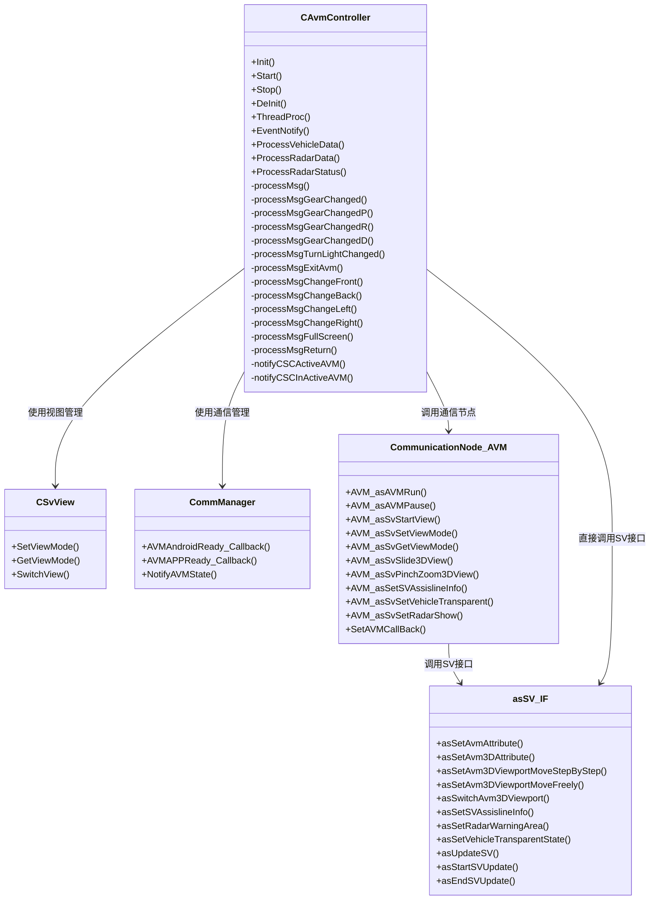
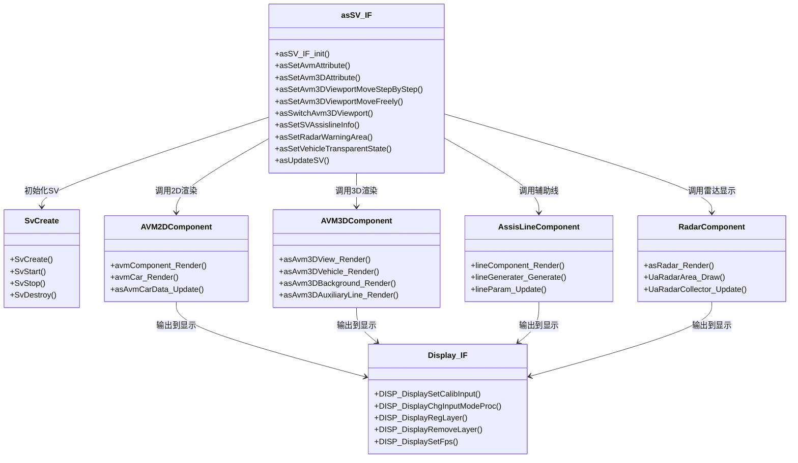
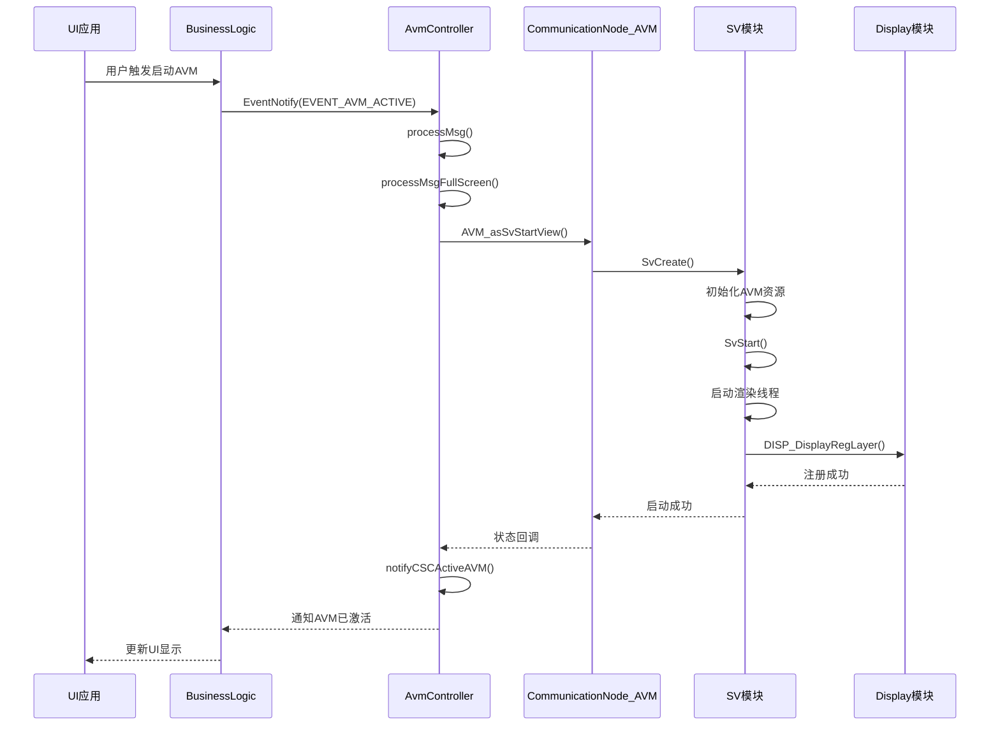
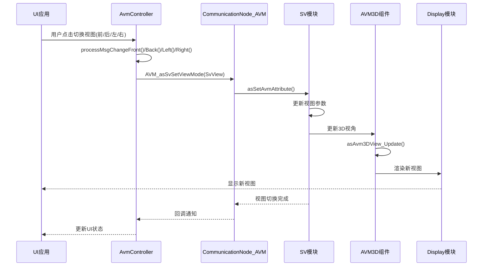
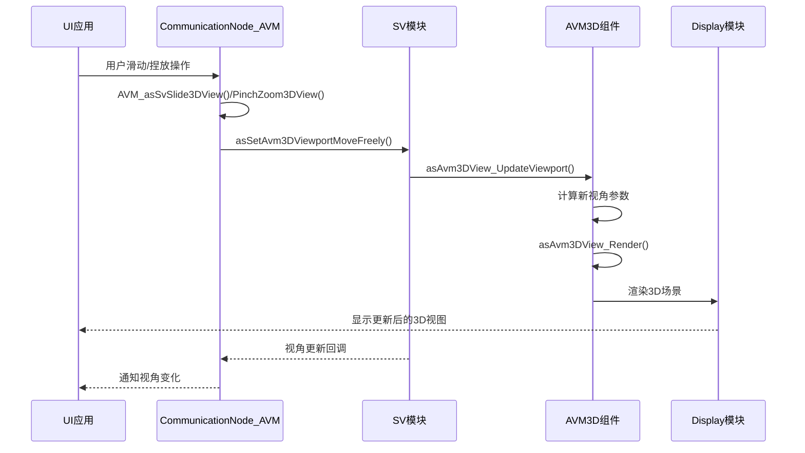
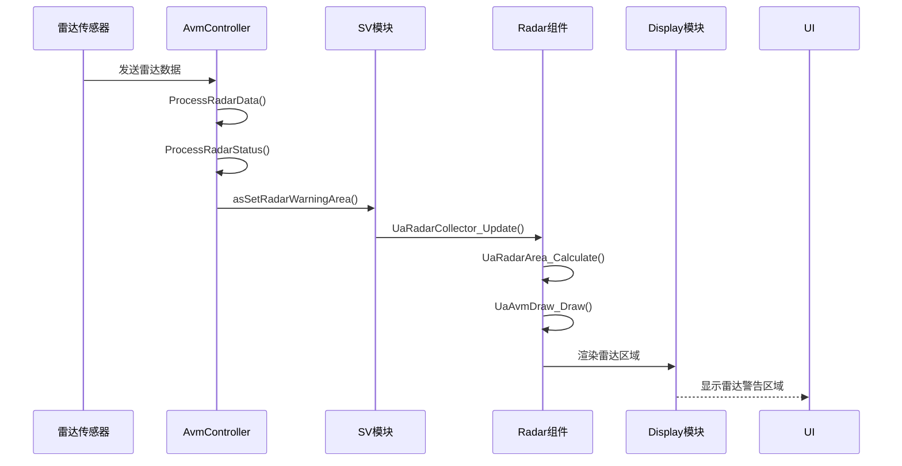
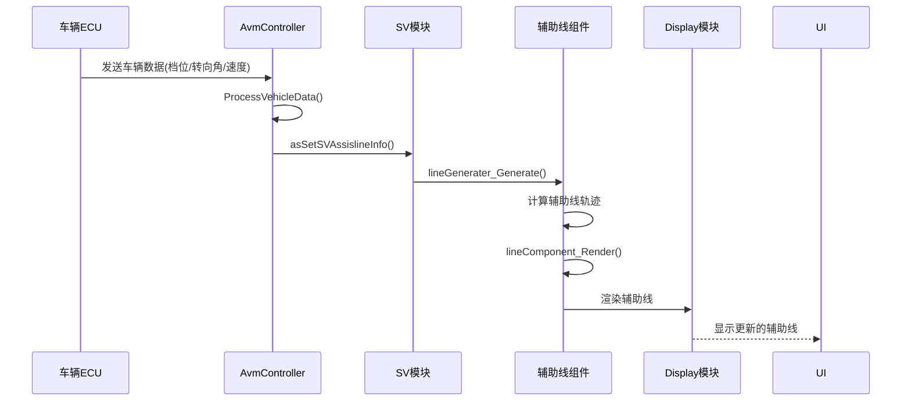
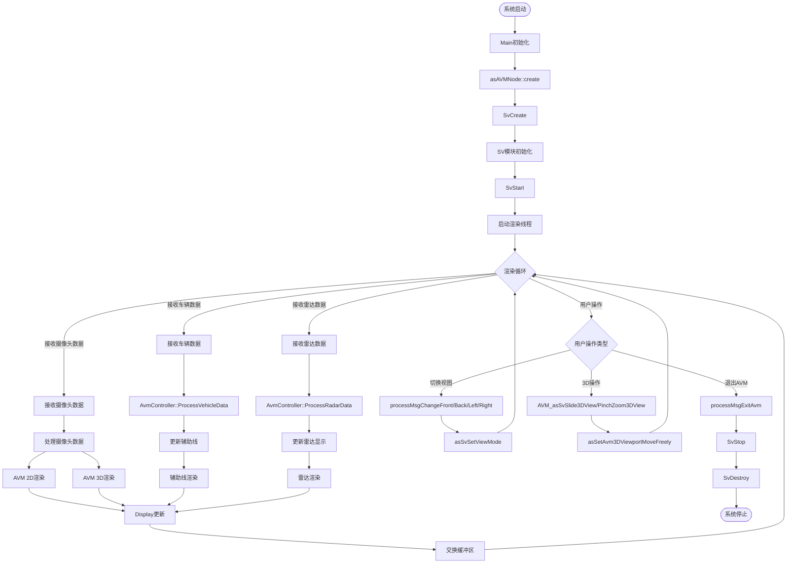

# D-Eskimo AVM全景影像系统架构图

## AVM系统整体架构

```mermaid
graph TB
    subgraph AppLayer["应用层"]
        UIUE[UI/UE应用<br/>Sf_VM_L2_UIUE]
        HMI[HMI界面]
    end
    
    subgraph BusinessLayer["业务逻辑层 - BUSINESSLOGIC"]
        AvmController[AVM控制器<br/>CAvmController]
        BusinessLogic[业务逻辑核心<br/>CBusinessLogic]
        CommManager[通信管理<br/>CommManager]
        UserConfig[用户配置<br/>CUserConfig]
    end
    
    subgraph SVLayer["SV全景影像核心层"]
        SVModule[SV模块<br/>asSV_IF]
        SvView[视图管理<br/>CSvView]
        AVM2D[AVM 2D渲染<br/>avm2D]
        AVM3D[AVM 3D渲染<br/>avm3D]
        AssisLine[辅助线<br/>assisLines]
        Radar[雷达显示<br/>RADAR]
        Expand[扩展渲染<br/>expand]
        GUI[GUI组件<br/>gui]
    end
    
    subgraph DisplayLayer["显示层 - DISPLAY"]
        Display[显示模块<br/>asDisplay_IF]
        DisplayLayer[显示层管理]
    end
    
    subgraph DataLayer["数据接口层"]
        CameraData[摄像头数据<br/>CameraData]
        VehicleData[车辆数据<br/>VehicleData]
        RadarData[雷达数据<br/>USRData]
    end
    
    subgraph CommLayer["通信层"]
        CommNodeAVM[AVM通信节点<br/>CommunicationNode_AVM]
        LogicProxy[逻辑代理<br/>LogicProxy]
    end
    
    subgraph ServiceLayer["服务层"]
        Logger[日志服务]
        MemManager[内存管理]
        OSAdaptor[操作系统适配器]
    end
    
    subgraph MainLayer["主程序层"]
        AVMNode[AVM节点<br/>asAVMNode]
        Main[主程序入口]
    end
    
    %% 应用层到业务层
    UIUE --> AvmController
    HMI --> AvmController
    
    %% 业务层内部
    AvmController --> BusinessLogic
    AvmController --> CommManager
    AvmController --> UserConfig
    BusinessLogic --> AvmController
    
    %% 业务层到SV层
    AvmController --> SVModule
    AvmController --> SvView
    SVModule --> AVM2D
    SVModule --> AVM3D
    SVModule --> AssisLine
    SVModule --> Radar
    SVModule --> Expand
    SVModule --> GUI
    
    %% SV层到显示层
    SVModule --> Display
    AVM2D --> Display
    AVM3D --> Display
    AssisLine --> Display
    Radar --> Display
    
    %% 数据流
    CameraData --> SVModule
    VehicleData --> AvmController
    RadarData --> AvmController
    RadarData --> SVModule
    
    %% 通信层
    CommNodeAVM --> AvmController
    CommNodeAVM --> SVModule
    LogicProxy --> CommNodeAVM
    
    %% 主程序层
    Main --> AVMNode
    AVMNode --> SVModule
    AVMNode --> AvmController
    
    %% 服务层
    AvmController --> Logger
    SVModule --> MemManager
    Display --> OSAdaptor
    
    style AppLayer fill:#e1f5ff
    style BusinessLayer fill:#fff4e1
    style SVLayer fill:#f3e5f5
    style DisplayLayer fill:#e8f5e9
    style DataLayer fill:#ffebee
    style CommLayer fill:#fce4ec
    style ServiceLayer fill:#e0f2f1
    style MainLayer fill:#fff9c4
```

## AVM模块方法调用关系

### 1. AVM控制器模块方法调用关系



### 2. SV模块方法调用关系



## AVM业务流程序列图

### 1. AVM启动流程



### 2. AVM视图切换流程



### 3. AVM 3D视角操作流程



### 4. AVM雷达显示流程



### 5. AVM辅助线更新流程



## AVM完整方法调用流程图



## AVM关键接口方法列表

### AvmController接口方法
- `CAvmController::Init()` - 初始化AVM控制器
- `CAvmController::Start()` - 启动AVM控制器
- `CAvmController::Stop()` - 停止AVM控制器
- `CAvmController::EventNotify()` - 事件通知处理
- `CAvmController::ProcessVehicleData()` - 处理车辆数据
- `CAvmController::ProcessRadarData()` - 处理雷达数据
- `CAvmController::ProcessRadarStatus()` - 处理雷达状态
- `CAvmController::processMsgGearChanged()` - 处理档位变化
- `CAvmController::processMsgTurnLightChanged()` - 处理转向灯变化
- `CAvmController::processMsgChangeFront()` - 切换到前视图
- `CAvmController::processMsgChangeBack()` - 切换到后视图
- `CAvmController::processMsgChangeLeft()` - 切换到左视图
- `CAvmController::processMsgChangeRight()` - 切换到右视图
- `CAvmController::processMsgExitAvm()` - 退出AVM
- `CAvmController::processMsgFullScreen()` - 全屏显示
- `CAvmController::notifyCSCActiveAVM()` - 通知CSC激活AVM
- `CAvmController::notifyCSCInActiveAVM()` - 通知CSC停用AVM

### CommunicationNode_AVM接口方法
- `AVM_asAVMRun()` - AVM运行
- `AVM_asAVMPause()` - AVM暂停
- `AVM_asSvStartView()` - 启动全景视图
- `AVM_asSvSetViewMode()` - 设置视图模式
- `AVM_asSvGetViewMode()` - 获取当前视图模式
- `AVM_asSvSlide3DView()` - 滑动3D视图
- `AVM_asSvPinchZoom3DView()` - 捏放缩放3D视图
- `AVM_asAVMGetCurModule()` - 获取当前模块
- `AVM_asSetSVAssislineInfo()` - 设置辅助线信息
- `AVM_asSvSetVehicleTransparent()` - 设置车辆透明
- `AVM_asSvSetRadarShow()` - 设置雷达显示
- `AVM_setMEBSwitch()` - 设置MEB开关
- `AVM_SetRenderWheelLogoDisplay()` - 设置轮毂Logo显示
- `SetAVMCallBack()` - 设置AVM回调

### asSV_IF接口方法
- `asSV_IF_init()` - 初始化SV接口
- `SvCreate()` - 创建SV模块
- `SvStart()` - 启动SV模块
- `SvStop()` - 停止SV模块
- `SvDestroy()` - 销毁SV模块
- `asSetAvmAttribute()` - 设置AVM属性
- `asSetAvm3DAttribute()` - 设置AVM 3D属性
- `asSetAvm3DViewportMoveStepByStep()` - 3D视角单步移动
- `asSetAvm3DViewportMoveFreely()` - 3D视角自由移动
- `asSwitchAvm3DViewport()` - 切换3D视角
- `asSetAvm3DViewportMovingStart()` - 开始3D视角连续移动
- `asSetAvm3DViewportMovingStop()` - 停止3D视角连续移动
- `asGetAvm3DViewportParam()` - 获取3D视角参数
- `asSetAvm3DViewportParam()` - 设置3D视角参数
- `asSetSVAssislineInfo()` - 设置辅助线信息
- `asSetRadarWarningArea()` - 设置雷达警告区域
- `asSetVehicleTransparentState()` - 设置车辆透明状态
- `asUpdateSV()` - 更新SV
- `asStartSVUpdate()` - 开始SV更新
- `asEndSVUpdate()` - 结束SV更新
- `asSetRadarSensitivity()` - 设置雷达灵敏度
- `asRadarSetValuesIF()` - 设置雷达值
- `asRadarSetLevelIF()` - 设置雷达级别
- `asRadarSetInfoIF()` - 设置雷达信息

### Display接口方法
- `DISP_DisplaySetCalibInput()` - 设置标定输入
- `DISP_DisplayChgInputModeProc()` - 改变输入模式
- `DISP_DisplayScreenShotProc()` - 截屏处理
- `DISP_DisplayRegLayer()` - 注册显示层
- `DISP_DisplayRemoveLayer()` - 移除显示层
- `DISP_DisplaySetFps()` - 设置帧率
- `DISP_DisplaySetHide()` - 设置隐藏
- `DISP_DisplayGetLockHandle()` - 获取锁句柄
- `DISP_RegistImgReadyCallback()` - 注册图像就绪回调

## 与AVM功能完全无关的内容

以下模块和功能与全景影像AVM功能完全无关，属于项目中的其他功能模块：

### 1. 泊车相关模块（APA - Auto Parking Assist）

#### 应用层模块
- **Sf_VCo_L2_ParkingFus** - 泊车融合应用
  - `ParkingFusDataDispatch` - 泊车融合数据分发
  - `Send_APP_SF_APA_Slot()` - 发送APA车位信息
  - `Send_APP_SF_APA_Replan_Slot()` - 发送APA重定位信息
  - `Send_APP_SF_APA_FSP_Distance()` - 发送APA自由空间距离
  - `Send_APP_Sf_APA_ObjInfo()` - 发送APA目标信息

- **Sf_VM_L2_ParkingPlan** - 泊车规划应用
  - `ParkingPlanDataDispatch` - 泊车规划数据分发
  - 路径规划相关接口

- **Sf_VCt_L2_USSPerc** - 超声波感知应用
  - `USSPercDataDispatch` - 超声波感知数据分发
  - 超声波雷达感知处理

- **Sf_VCt_L2_ParkingSenCalib** - 泊车传感器标定应用
- **Sf_VCt_L2_ServiceParkingSenCalib** - 泊车传感器服务标定应用

#### 核心层模块
- **PerceptionFusion** - 感知融合模块
  - `IPerceptionFusion` - 感知融合接口
  - `PerceptionFusionStart()` - 启动感知融合
  - `PerceptionFusionStop()` - 停止感知融合
  - `PerceptionSearchingSlot()` - 搜索车位
  - `PerceptionObstcleDetect()` - 障碍物检测
  - `PerceptionParkingReplan()` - 泊车重定位
  - `PerceptionFreeSpace()` - 自由空间检测
  - `PerceptionSendVeh()` - 发送车辆信息
  - `PerceptionSendUslot()` - 发送超声波车位信息
  - `PerceptionSendVpf()` - 发送视觉信息

- **FUSION** - 融合决策模块
  - `FusionDecision` - 融合决策
  - `ObjectFusion` - 目标融合
  - `ParkingSpaceFusion` - 停车位融合
  - `IFuisonDecisionInit()` - 初始化融合决策
  - `IFuisonDecisionStart()` - 启动融合决策

- **PERCEPTION** - 感知模块
  - `ParkingSpaceUSR` - 停车位超声波雷达
  - `ObstacleSpaceUSR` - 障碍物超声波雷达
  - `ParkingSpaceCamera` - 停车位摄像头

- **TrajectoryPlanner** - 轨迹规划模块
- **TrajectoryTracking** - 轨迹跟踪模块
- **DecisionAPA** - APA决策模块
- **APACommunicator** - APA通信模块

### 2. 定位相关模块

- **FusionPosition** - 融合定位模块
  - `FusionPosition` - 融合定位核心
  - `VehiclePosition` - 车辆定位
  - `LocationAPA` - APA定位

- **VSLAM** - 视觉SLAM模块
- **VioSlam** - 视觉惯性SLAM模块

### 3. 视觉感知模块（非AVM显示用途）

- **VISUALPERCEPTION** - 视觉感知模块
  - `VisualObject` - 视觉目标检测（用于泊车感知，非AVM显示）
  - `FreeSpaceSS` - 自由空间检测
  - `ParkingSpaceSemantics` - 停车位语义识别
  - `CameraDirtyCheck` - 摄像头脏污检测（用于感知，非AVM显示）

### 4. 地图相关模块

- **MapDataService** - 地图数据服务
- **MapDataDBAdaptor** - 地图数据库适配器
- **MapDataRoute** - 地图路径服务
- **MapDataGuide** - 地图导航服务
- **MapDataSearch** - 地图搜索服务
- **MapDataMapMatch** - 地图匹配服务
- **MapBuild** - 地图构建

### 5. 其他决策模块

- **DecisionHPP** - HPP决策模块（Home Parking Pilot）
- **DecisionAVP** - AVP决策模块（Automated Valet Parking）
- **DecisionPAS** - PAS决策模块
- **DecisionEFS** - EFS决策模块
- **DecisionRCS** - RCS决策模块

### 6. 预警模块（非AVM显示用途）

- **WARNING** - 预警模块
  - `USRWarning` - 超声波预警（用于泊车预警，非AVM显示）
  - `BSWarning` - 盲区预警
  - `CTWarning` - 交叉路口预警
  - `DOWarning` - 开门预警
  - `MOWarning` - 移动物体预警

- **ADAS_BSD** - ADAS盲区检测
- **ADAS_MOD** - ADAS移动物体检测

### 7. 其他功能模块

- **DVR** - 行车记录仪模块
- **FeatureFusion** - 特征融合模块
- **FreeSpaceDetection** - 自由空间检测模块
- **ParkingSpaceFeature** - 停车位特征模块
- **Network** - 网络模块
- **DispatchService** - 调度服务模块

### 8. 通信节点（非AVM相关）

- **CommunicationNode_APA** - APA通信节点
  - `APA_StartSearchParking()` - 开始搜索车位
  - `APA_StopSearchParking()` - 停止搜索车位
  - `APA_SetParkInTargetParkingSpace()` - 设置泊入目标车位
  - `APA_StartParkIn()` - 开始泊入
  - `APA_StartParkOut()` - 开始泊出
  - `APA_SuspendPark()` - 暂停泊车
  - `APA_ResumePark()` - 恢复泊车
  - `APA_StopPark()` - 停止泊车

### 9. 数据接口（非AVM显示用途）

- **FrontRadarData** - 前雷达数据（用于泊车感知）
- **FrontCameraData** - 前摄像头数据（用于泊车感知）
- **GPSData** - GPS数据（用于定位）
- **IMUData** - IMU数据（用于定位）

### 10. 业务逻辑中的非AVM部分

- **BusinessLogic** 中的泊车相关功能
  - APA相关的业务逻辑处理
  - 泊车路径规划逻辑
  - 泊车控制逻辑

### 总结

以上列出的所有模块和功能都与**全景影像AVM功能完全无关**，它们属于项目中的其他功能模块，主要包括：

1. **泊车辅助系统（APA）** - 自动泊车相关功能
2. **感知融合系统** - 多传感器融合用于泊车感知
3. **定位系统** - 车辆定位和SLAM
4. **视觉感知系统** - 用于泊车感知的视觉处理
5. **地图服务系统** - 地图相关功能
6. **其他决策系统** - HPP、AVP、PAS等
7. **预警系统** - 各种预警功能（非AVM显示）

**注意**：虽然AVM和泊车系统可能共享一些基础设施（如摄像头数据、车辆数据、雷达数据），但它们的业务逻辑、处理流程和显示目的完全不同。AVM专注于全景影像的显示和交互，而泊车系统专注于自动泊车的感知、决策和控制。

## AVM架构说明

### 1. 应用层
- **UI/UE应用**：用户界面和交互
- **HMI界面**：人机交互界面

### 2. 业务逻辑层
- **AVM控制器（CAvmController）**：AVM业务逻辑核心，处理各种事件和状态管理
- **业务逻辑核心（CBusinessLogic）**：整体业务逻辑协调
- **通信管理（CommManager）**：处理与外部系统的通信
- **用户配置（CUserConfig）**：管理用户个性化设置

### 3. SV全景影像核心层
- **SV模块（asSV_IF）**：全景影像核心接口
- **AVM 2D渲染**：2D鸟瞰图渲染
- **AVM 3D渲染**：3D全景视图渲染
- **辅助线组件**：动态辅助线生成和渲染
- **雷达组件**：雷达警告区域显示
- **扩展渲染**：扩展元素渲染
- **GUI组件**：图形用户界面元素

### 4. 显示层
- **显示模块（asDisplay_IF）**：显示输出管理
- **显示层管理**：多图层管理

### 5. 数据接口层
- **摄像头数据**：四路摄像头图像数据
- **车辆数据**：档位、转向角、速度等车辆状态
- **雷达数据**：超声波雷达障碍物信息

### 6. 通信层
- **AVM通信节点**：AVM模块间通信接口
- **逻辑代理**：业务逻辑通信代理

### 7. 主程序层
- **AVM节点**：AVM模块主程序入口
- **主程序**：系统主程序

### 8. 服务层
- **日志服务**：系统日志记录
- **内存管理**：内存资源管理
- **操作系统适配器**：操作系统接口适配

