# D-Eskimo 自动泊车系统架构图

## 系统整体架构

```mermaid
graph TB
    subgraph Layer1["应用层 - VDC_APA_APP_Framework"]
        direction TB
        AppM[应用管理<br/>Sf_VCt_L2_ParkingAppM]
        
        subgraph Apps["应用模块"]
            ParkingFus[泊车融合应用<br/>Sf_VCo_L2_ParkingFus]
            UIUE[UI/UE应用<br/>Sf_VM_L2_UIUE]
            ParkingPlan[泊车规划应用<br/>Sf_VM_L2_ParkingPlan]
            USSPerc[超声波感知应用<br/>Sf_VCt_L2_USSPerc]
            SenCalib[传感器标定应用<br/>Sf_VCt_L2_ParkingSenCalib]
            ServiceCalib[服务标定应用<br/>Sf_VCt_L2_ServiceParkingSenCalib]
        end
        
        Middleware[中间件层<br/>Middleware]
        CameraInterface[摄像头接口<br/>Camera Interface]
    end
    
    subgraph Layer2["核心层 - Core/SERVER"]
        direction TB
        
        subgraph Business["业务逻辑层 - BUSINESSLOGIC"]
            BusinessLogic[业务逻辑核心<br/>BusinessLogic]
            HMI[HMI模块]
            Controller[控制器模块]
            DataManager[数据管理模块]
        end
        
        subgraph Perception["感知层 - PERCEPTION"]
            ParkingSpaceUSR[停车位超声波雷达<br/>ParkingSpaceUSR]
            ObstacleSpaceUSR[障碍物超声波雷达<br/>ObstacleSpaceUSR]
            ParkingSpaceCamera[停车位摄像头<br/>ParkingSpaceCamera]
        end
        
        subgraph Fusion["融合层"]
            PerceptionFusion[感知融合<br/>PerceptionFusion]
            FusionDecision[融合决策<br/>FusionDecision]
            ObjectFusion[目标融合<br/>ObjectFusion]
            ParkingSpaceFusion[停车位融合<br/>ParkingSpaceFusion]
        end
        
        subgraph Position["定位层 - FusionPosition"]
            FusionPosition[融合定位<br/>FusionPosition]
            VehiclePosition[车辆定位<br/>VehiclePosition]
            LocationAPA[APA定位<br/>Location_APA]
        end
        
        subgraph Visual["视觉感知层 - VISUALPERCEPTION"]
            VisualObject[视觉目标检测<br/>VisualObject]
            FreeSpaceSS[自由空间检测<br/>FreeSpaceSS]
            ParkingSpaceSemantics[停车位语义<br/>ParkingSpaceSemantics]
            CameraDirtyCheck[摄像头脏污检测<br/>CameraDirtyCheck]
        end
        
        subgraph Data["数据接口层 - DATA"]
            VehicleData[车辆数据<br/>VehicleData]
            CameraData[摄像头数据<br/>CameraData]
            USRData[超声波雷达数据<br/>USRData]
            FrontRadarData[前雷达数据<br/>FrontRadarData]
            FrontCameraData[前摄像头数据<br/>FrontCameraData]
        end
        
        subgraph Service["服务层 - SERVICE"]
            Logger[日志服务<br/>DoggyLogger]
            MemManager[内存管理<br/>MemManager]
            CommAdaptor[通信适配器<br/>CommunicationAdaptor]
            ConfigCache[配置缓存<br/>ConfigureCache]
            HealthManagement[健康管理<br/>HealthManagement]
            OSAdaptor[操作系统适配器<br/>OSAdaptor]
        end
        
        subgraph Main["主程序层 - MAIN"]
            Main[主程序入口<br/>Main]
            LogicProxy[逻辑代理<br/>LogicProxy]
        end
        
        Display[显示模块<br/>DISPLAY]
        USRWarning[预警模块<br/>WARNING/USRWarning]
        CameraCalib[标定模块<br/>CALIB/CameraCALIB]
        
        ThirdPart[第三方库<br/>OpenCV/Eigen3]
    end
    
    subgraph Layer3["基础层 - AppBase"]
        APAService[APA服务<br/>apa_service]
        HeartBeat[心跳检测<br/>HeartBeat]
        FusMain[融合主程序<br/>FusMain]
        UIMain[UI主程序<br/>UIMain]
        BusinessLogicMain[业务逻辑主程序<br/>BusinessLogicMain]
    end
    
    subgraph Comm["通信协议层"]
        DDS[DDS<br/>数据分发服务]
        SOMEIP[SOME/IP<br/>服务通信]
        IPC[IPC<br/>进程间通信]
    end
    
    subgraph External["外部接口"]
        VehicleECU[车辆ECU<br/>EPS/ABS/IBC/DMS]
        Sensors[传感器<br/>摄像头/雷达/USR]
    end
    
    %% 应用层内部连接
    AppM --> Apps
    Apps --> Middleware
    
    %% 应用层到核心层
    ParkingFus --> PerceptionFusion
    ParkingFus --> FusionDecision
    USSPerc --> ParkingSpaceUSR
    ParkingPlan --> BusinessLogic
    UIUE --> Display
    UIUE --> HMI
    SenCalib --> CameraCalib
    ServiceCalib --> CameraCalib
    
    %% 核心层内部连接
    BusinessLogic --> Controller
    BusinessLogic --> DataManager
    BusinessLogic --> HMI
    BusinessLogic --> FusionDecision
    BusinessLogic --> FusionPosition
    
    PerceptionFusion --> ParkingSpaceUSR
    PerceptionFusion --> ObstacleSpaceUSR
    PerceptionFusion --> ParkingSpaceCamera
    PerceptionFusion --> VisualObject
    
    FusionDecision --> ObjectFusion
    FusionDecision --> ParkingSpaceFusion
    FusionDecision --> PerceptionFusion
    
    %% 数据流
    VehicleData --> BusinessLogic
    CameraData --> PerceptionFusion
    USRData --> ParkingSpaceUSR
    USRData --> ObstacleSpaceUSR
    FrontRadarData --> FusionDecision
    FrontCameraData --> VisualObject
    
    %% 服务层连接
    Main --> Service
    LogicProxy --> CommAdaptor
    BusinessLogic --> LogicProxy
    
    %% 基础层连接
    APAService --> BusinessLogicMain
    APAService --> FusMain
    APAService --> UIMain
    APAService --> HeartBeat
    BusinessLogicMain --> BusinessLogic
    FusMain --> PerceptionFusion
    UIMain --> Display
    
    %% 通信协议连接
    Middleware --> Comm
    CommAdaptor --> Comm
    
    %% 外部接口连接
    VehicleECU --> VehicleData
    Sensors --> Data
    CameraInterface --> CameraData
    CameraInterface --> VisualObject
    
    %% 第三方库
    VisualObject --> ThirdPart
    PerceptionFusion --> ThirdPart
    FusionPosition --> ThirdPart
    
    %% 样式
    classDef appLayer fill:#e1f5ff,stroke:#01579b,stroke-width:2px
    classDef coreLayer fill:#fff4e1,stroke:#e65100,stroke-width:2px
    classDef baseLayer fill:#e8f5e9,stroke:#2e7d32,stroke-width:2px
    classDef commLayer fill:#ffebee,stroke:#c62828,stroke-width:2px
    classDef dataLayer fill:#f3e5f5,stroke:#6a1b9a,stroke-width:2px
    
    class AppM,ParkingFus,UIUE,ParkingPlan,USSPerc,SenCalib,ServiceCalib appLayer
    class BusinessLogic,PerceptionFusion,FusionDecision,FusionPosition,VisualObject coreLayer
    class APAService,HeartBeat,FusMain,UIMain,BusinessLogicMain baseLayer
    class DDS,SOMEIP,IPC commLayer
    class VehicleData,CameraData,USRData,FrontRadarData,FrontCameraData dataLayer
```

## 分层架构图

```mermaid
graph LR
    subgraph L1["第一层：应用层"]
        A1[泊车融合应用]
        A2[UI/UE应用]
        A3[泊车规划应用]
        A4[超声波感知应用]
    end
    
    subgraph L2["第二层：业务逻辑层"]
        B1[业务逻辑核心]
        B2[融合决策]
        B3[轨迹规划]
        B4[轨迹跟踪]
    end
    
    subgraph L3["第三层：感知融合层"]
        C1[感知融合]
        C2[目标融合]
        C3[停车位融合]
    end
    
    subgraph L4["第四层：感知层"]
        D1[超声波感知]
        D2[视觉感知]
        D3[雷达感知]
    end
    
    subgraph L5["第五层：数据接口层"]
        E1[车辆数据]
        E2[传感器数据]
    end
    
    subgraph L6["第六层：服务层"]
        F1[日志服务]
        F2[内存管理]
        F3[通信适配]
    end
    
    L1 --> L2
    L2 --> L3
    L3 --> L4
    L4 --> L5
    L5 --> L6
    
    style L1 fill:#e1f5ff
    style L2 fill:#fff4e1
    style L3 fill:#f3e5f5
    style L4 fill:#e8f5e9
    style L5 fill:#ffebee
    style L6 fill:#fce4ec
```

## 数据流架构图

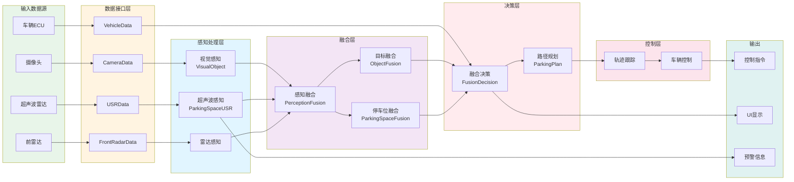

## 模块通信架构图

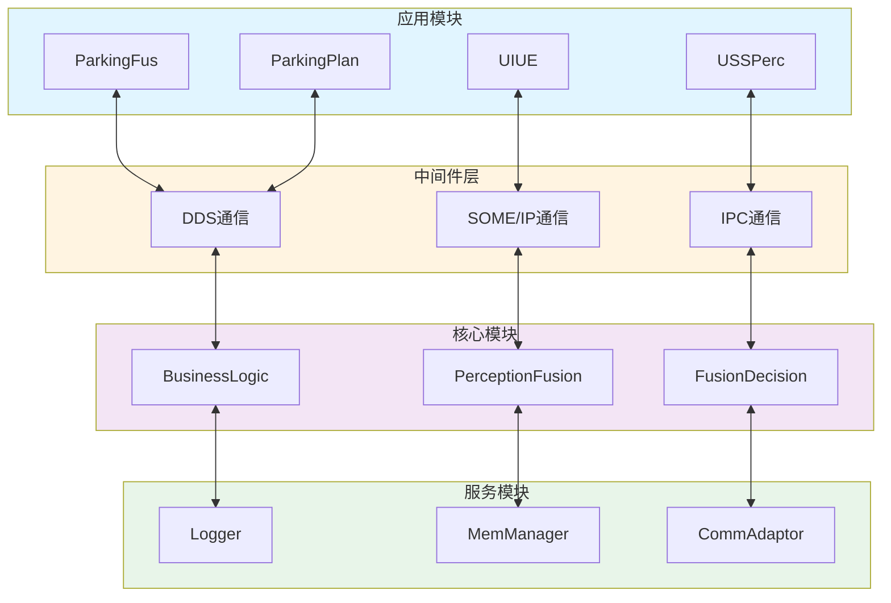

## 方法调用关系详细架构图

### 1. 感知融合模块方法调用关系

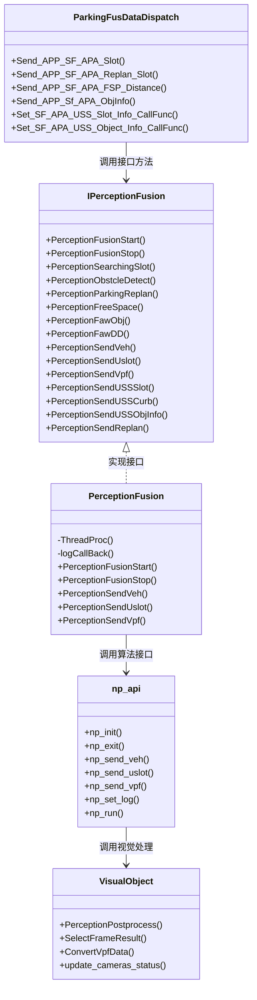

### 2. 业务逻辑模块方法调用关系

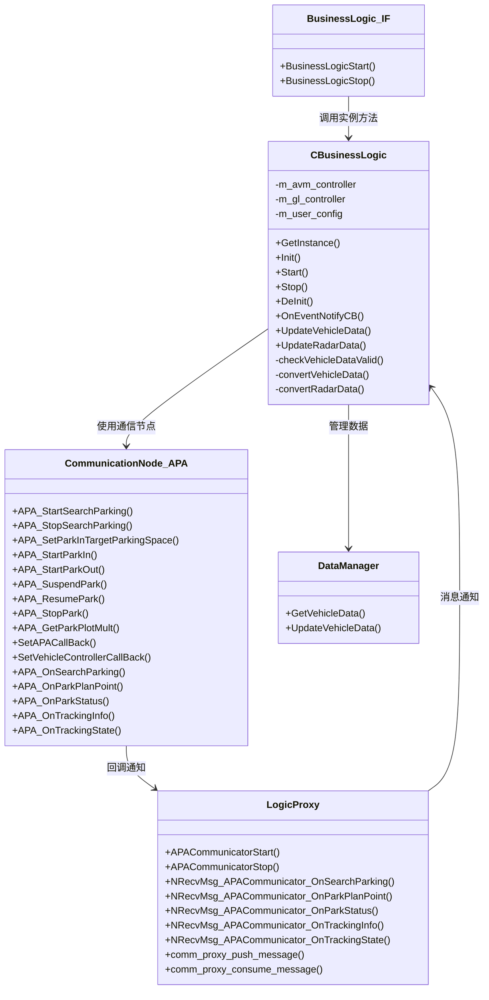

### 3. 融合决策模块方法调用关系

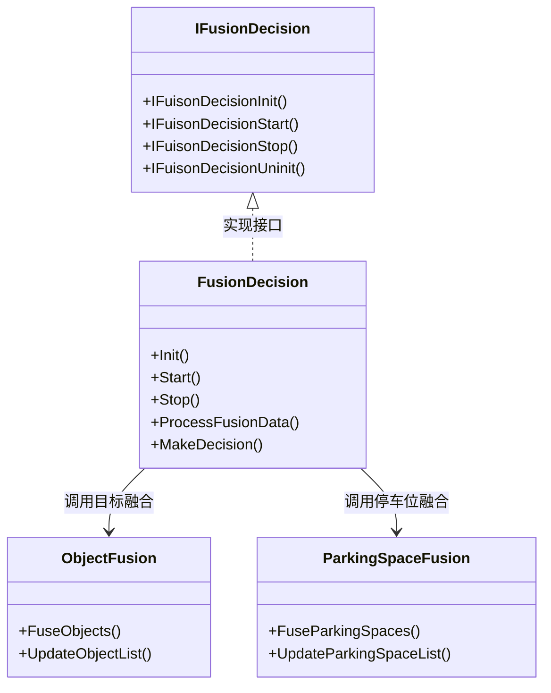

### 4. 完整的数据流和调用序列图

#### 4.1 车位搜索流程

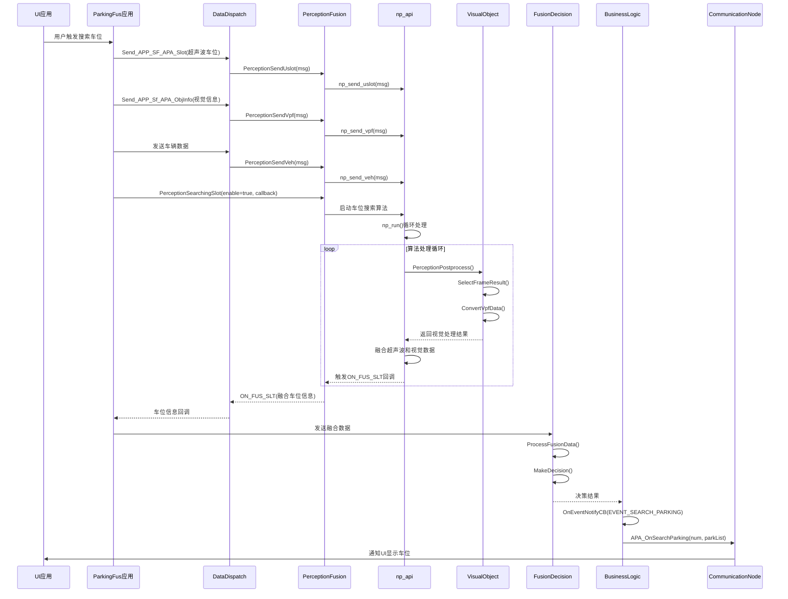

#### 4.2 泊车执行流程

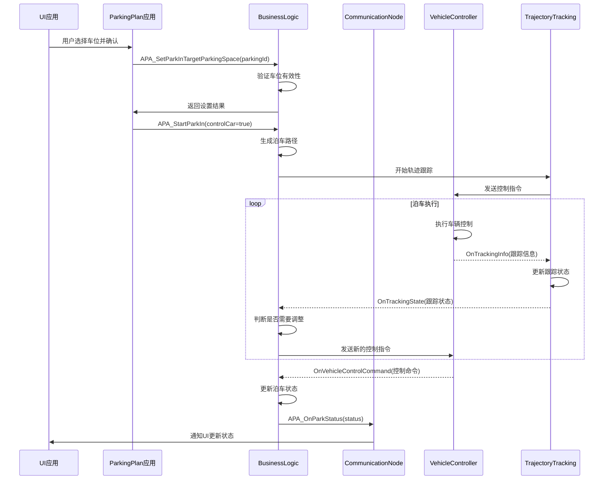

#### 4.3 障碍物检测流程

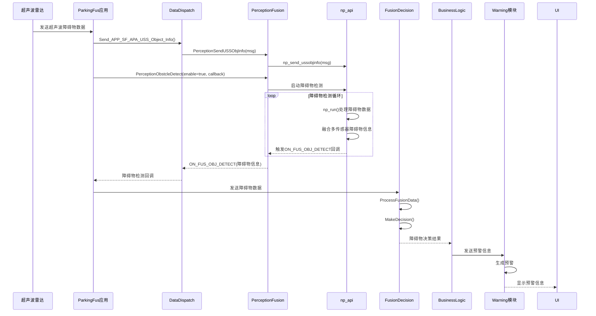

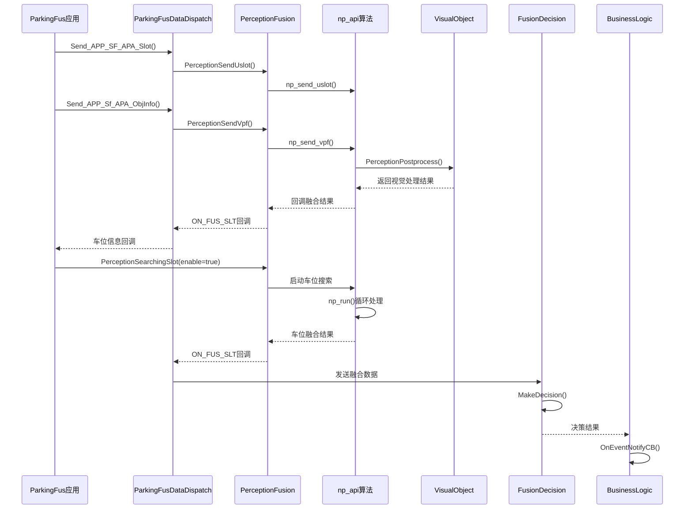

### 5. 回调函数调用关系图

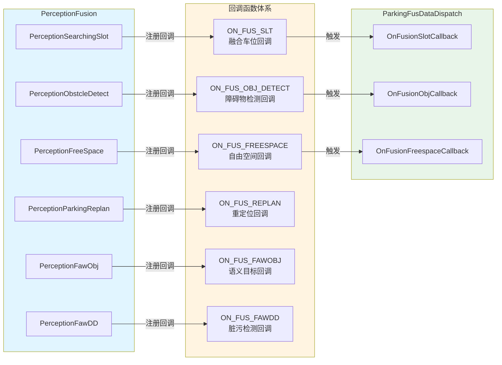

### 6. 完整的方法调用流程图

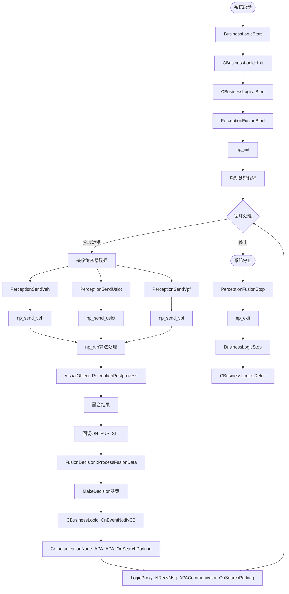

### 7. 模块间方法调用详细关系

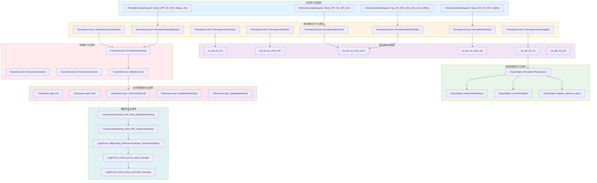

### 8. 关键接口方法列表

#### PerceptionFusion接口方法
- `PerceptionFusionStart()` - 启动感知融合
- `PerceptionFusionStop()` - 停止感知融合
- `PerceptionSearchingSlot()` - 搜索车位控制
- `PerceptionObstcleDetect()` - 障碍物检测
- `PerceptionParkingReplan()` - 泊车重定位
- `PerceptionFreeSpace()` - 自由空间检测
- `PerceptionFawObj()` - 语义目标信息
- `PerceptionFawDD()` - 脏污检测
- `PerceptionSendVeh()` - 发送车辆信息
- `PerceptionSendUslot()` - 发送超声波车位信息
- `PerceptionSendVpf()` - 发送视觉信息
- `PerceptionSendUSSSlot()` - 发送超声波车位信息
- `PerceptionSendUSSCurb()` - 发送路沿信息
- `PerceptionSendUSSObjInfo()` - 发送障碍物信息
- `PerceptionSendReplan()` - 发送重定位信息

#### BusinessLogic接口方法
- `BusinessLogicStart()` - 启动业务逻辑
- `BusinessLogicStop()` - 停止业务逻辑
- `CBusinessLogic::Init()` - 初始化
- `CBusinessLogic::Start()` - 启动
- `CBusinessLogic::Stop()` - 停止
- `CBusinessLogic::OnEventNotifyCB()` - 事件通知回调
- `CBusinessLogic::UpdateVehicleData()` - 更新车辆数据
- `CBusinessLogic::UpdateRadarData()` - 更新雷达数据

#### CommunicationNode_APA接口方法
- `APA_StartSearchParking()` - 开始搜索车位
- `APA_StopSearchParking()` - 停止搜索车位
- `APA_SetParkInTargetParkingSpace()` - 设置泊入目标车位
- `APA_StartParkIn()` - 开始泊入
- `APA_StartParkOut()` - 开始泊出
- `APA_SuspendPark()` - 暂停泊车
- `APA_ResumePark()` - 恢复泊车
- `APA_StopPark()` - 停止泊车
- `APA_GetParkPlotMult()` - 获取多个车位信息
- `SetAPACallBack()` - 设置APA回调
- `SetVehicleControllerCallBack()` - 设置车辆控制回调

#### FusionDecision接口方法
- `IFuisonDecisionInit()` - 初始化融合决策
- `IFuisonDecisionStart()` - 启动融合决策
- `IFuisonDecisionStop()` - 停止融合决策
- `IFuisonDecisionUninit()` - 反初始化融合决策

### 9. 方法调用关系总览图

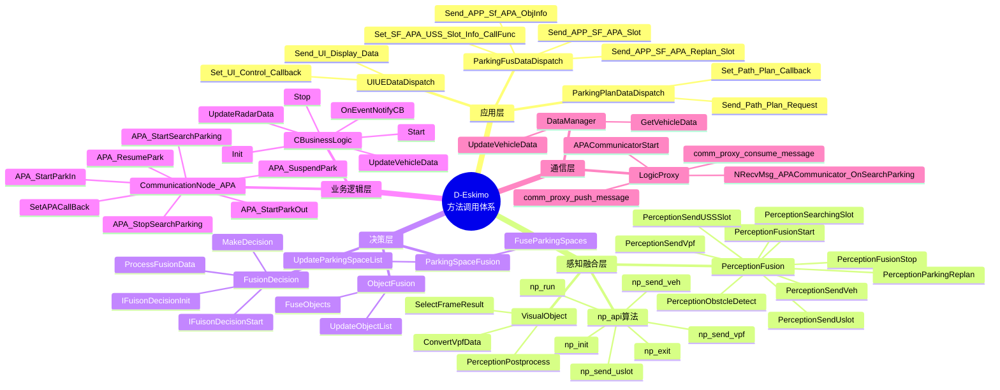

## 架构说明

### 1. 应用层（VDC_APA_APP_Framework）
- **应用管理（AppM）**：管理各个应用的生命周期
- **泊车融合应用（ParkingFus）**：负责多传感器数据融合
- **UI/UE应用（UIUE）**：用户界面和用户体验
- **泊车规划应用（ParkingPlan）**：路径规划和决策
- **超声波感知应用（USSPerc）**：超声波雷达数据处理
- **传感器标定应用**：传感器标定功能

### 2. 核心层（Core）
- **业务逻辑**：核心业务处理逻辑
- **感知模块**：多传感器感知处理
- **感知融合**：多传感器数据融合
- **融合决策**：融合后的决策处理
- **定位模块**：车辆定位和融合定位
- **视觉感知**：基于视觉的感知算法
- **数据层**：各类传感器数据接口
- **服务层**：系统级服务（日志、内存、通信等）

### 3. 基础层（AppBase）
- **APA服务**：APA系统服务入口
- **心跳检测**：系统健康监控
- **主程序**：各功能模块的主程序入口

### 4. 通信协议
- **DDS**：数据分发服务，用于实时数据通信
- **SOME/IP**：面向服务的通信协议
- **IPC**：进程间通信

### 5. 外部接口
- **车辆ECU**：与车辆电子控制单元通信（EPS、ABS、IBC、DMS等）
- **传感器**：摄像头、雷达、超声波雷达等传感器接口

